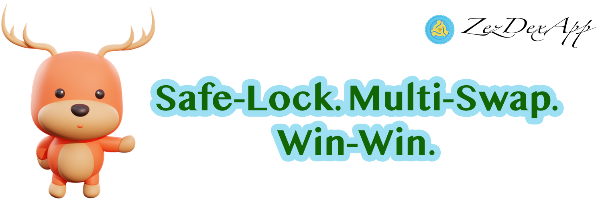

# Overview of ZexdexApp Products


**ZexdexApp is a crypto services platform, a decentralized exchange, and a decentralized launchpad that allows users to launch their tokens and generate their token sales.**
**ZexdexApp helps you make the most out of your crypto in three ways:**

**Safe-Lock, Multi-Swap, and Win-Win.**


## 🔓 Safe-Lock

> Freely lock-unlock your crypto asset directly from your wallet and win trading-fee from zexdex.

### The people's choice

On Binance Smart Chain, ZexdexApp is the top decentralized exchange with the biggest trading volumes. (sources: [1](https://www.coingecko.com/en/exchanges/decentralized) [2](https://coinmarketcap.com/rankings/exchanges/dex/)).

### Low fees

Why would you want to spend more? The blockchain used by ZexdexApp, Binance Smart Chain, has substantially less transaction fees than Ethereum or Bitcoin.\
You win twice because the trading fees are lower than those charged by other leading decentralized exchanges.

### Decentralized

Trade directly from your wallet app.\
Users can conduct transactions without registering and directly from their wallets. As opposed to centralized exchanges, your coins are not kept by Zexdex when you trade. **You have 100% ownership of your own crypto**.

## 🛸 Multi-Swap

> Earn free zDEX and other tokens with astronomically high rates of interest.

### Multi Collateral Liquidity Pools

What would be the best attributes a liquidity pool might have, if we could list them?
Multiple collateral types and transient loss mitigation are undoubtedly at the top of the list. But what if we could also include private pools?
For AMMs, ZexdexApp is a game-changing innovation that opens the door to huge liquidity and multi-collateral trading.

### Liquidity Providers are King

The monarchs of ZexdexApp are LPs. We believe that the present DeFi protocols do not adequately compensate LPs for their risk. In particular for farming apps. Farms are funded by Liquidity Providers (LPs), and LPs can (and frequently do) lose money if they aren't nimble enough.
Multi-collateral ZexdexApp pools significantly lower the risks for LPs in all circumstances.
The most LP-friendly AMM currently in use is ZexdexApp.

### Earn Trading Fees

No farms? No issue. You can still make trading fees by staking your tokens in Liquidity Pools (LPs) even if your trading pair isn't offered on the Farms page.

## 🎲 Win-Win

> ZexdexApp makes making money fun.

### Zexdex Launchpad

**Dozens of Projects** often available on the Zexdex Launchpad.\
Join as many as **100 monthly projects** for your chance to to increase your investment!

### Zexdex NFT Marketplaces

Just upload your work, create it to make it unique, and start monetizing whenever someone buys it.

### OTC Trading

Deals are facilitated by third-party stock exchanges by mediating price negotiations between buyers and sellers.

### Zexdex Staking

A significant possibility to win double benefits, including a discount on our service fee and a profit/revenue share from the Zexdex Launchpad projects you have selected.

## Is ZexdexApp safe?

See for yourself:

**Sounds like fun?**\
**Then get a try!** 🐰 🥞

---
